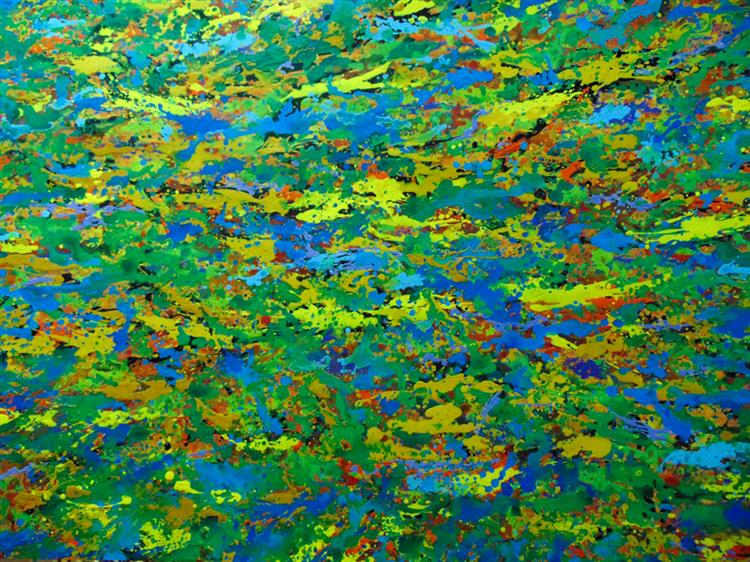
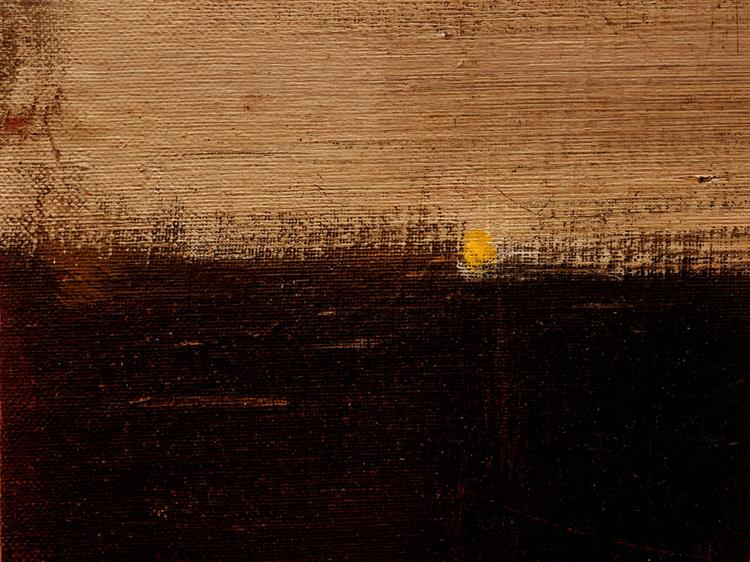
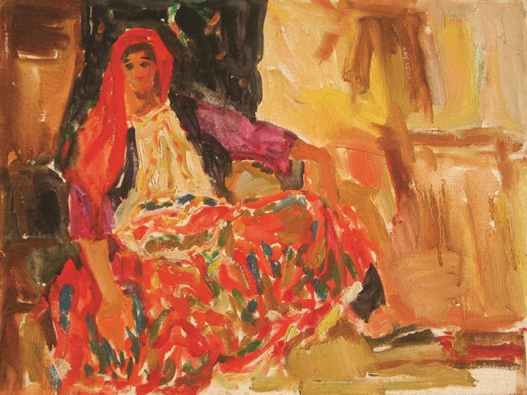
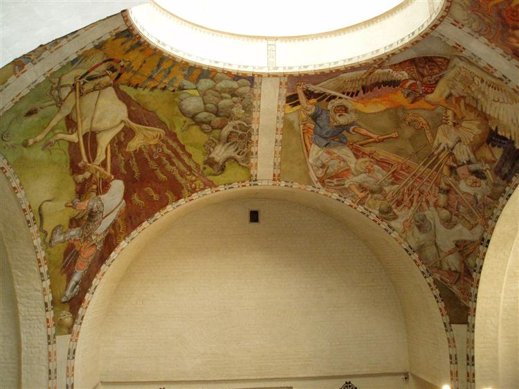
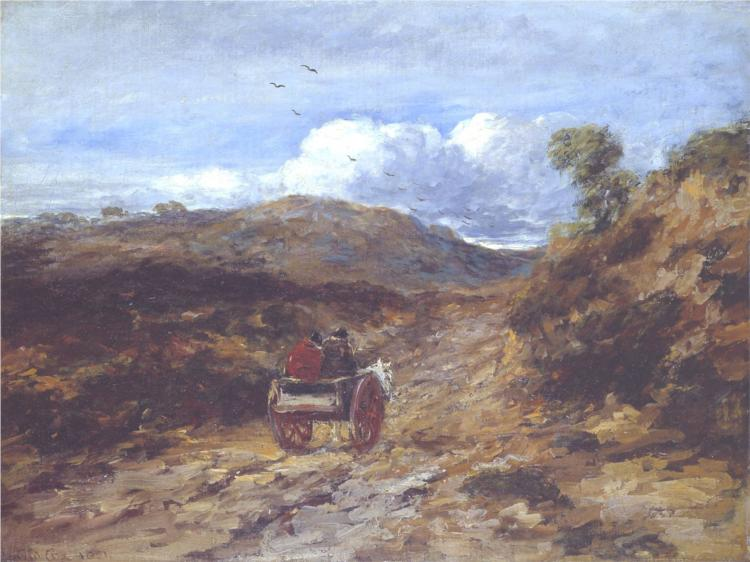
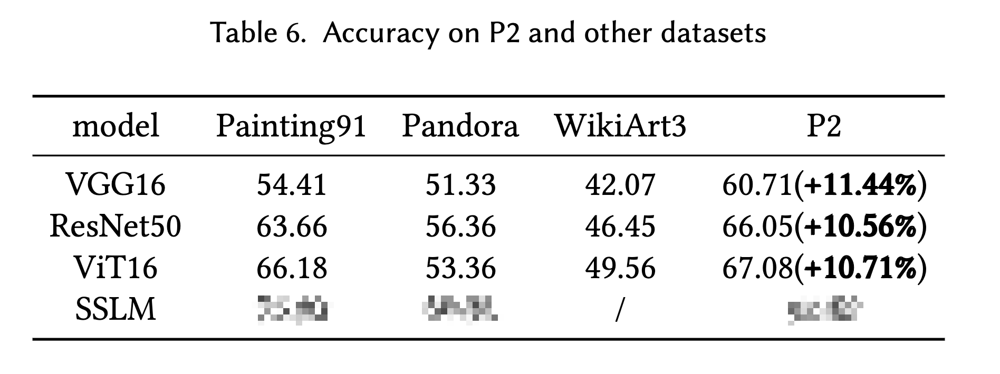

# <span style="color: red;">P2</span>: A <span style="color: red;">P</span>urified Painting Style Classification Dataset (v<span style="color: red;">2</span>.0)

## Overview
This repository provides the P2 dataset, a curated and purified painting dataset for style classification in the context of artistic image analysis.

## Dataset Information
- **Dataset Name**: Purified Painting Style Classification Dataset
- **Version**: 2.0
- **Creation Date**: 2025-07-20
- **Last Updated**: 2025-07-20
- **Dataset Size**: 1.8GB
- **Data Format**: JPG

## Data Source
All painting images were selected from existing public painting datasets (Painting-91, Pandora, and WikiArt). The objective was to retain images with clear and consistent stylistic characteristics, which significantly improves downstream classification performance. Therefore, all painting images with specific styles were filtered through a two-step process:

1. **Automated Filtering**: Using the Style Uncertainty Measurement (SUM) proposed in our paper to select those with lower style uncertainties—the purified ones in terms of style.
2. **Manual Verification**: For the selected paintings, we engaged design professionals to conduct manual verification and quality assessment.
   
**Dataset Download:**
- Platform: Baidu Yun
- Link: https://pan.baidu.com/s/1yl22LCQIUDXiFqyqjW4r0g
- Password: Available upon paper publication

## Related Work
- **Painting-91 Dataset**: Khan, Fahad Shahbaz, et al. "Painting-91: a large scale database for computational painting categorization." *Machine Vision and Applications* 25.6 (2014): 1385-1397.
- **Pandora Style Dataset**: Florea, Corneliu, et al. "Pandora: Description of a painting database for art movement recognition with baselines and perspectives." *2016 24th European Signal Processing Conference (EUSIPCO)*. IEEE, 2016.
- **WikiArt Dataset**: Saleh, Babak, and Ahmed Elgammal. "Large-scale classification of fine-art paintings: Learning the right metric on the right feature." *arXiv preprint arXiv:1505.00855* (2015).

## Dataset Structure
The P2 dataset is organized in a hierarchical structure with clear separation of images, labels, and metadata files.

### Directory Organization
```
P2_dataset/
├── images/                          # Painting images organized by style
│   ├── Abstract-expressionism/      # Abstract expressionism paintings (2,971 files)
│   │   ├── Ab0001.jpg
│   │   ├── Ab0002.jpg
│   │   └── ...
│   ├── Baroque/                     # Baroque style paintings (1,056 files)
│   │   ├── Ba0001.jpg
│   │   ├── Ba0002.jpg
│   │   └── ...
│   ├── Impressionism/               # Impressionist paintings (6,277 files)
│   │   ├── Im0001.jpg
│   │   ├── Im0002.jpg
│   │   └── ...
│   ├── Realism/                     # Realist paintings (5,622 files)
│   │   ├── Re0001.jpg
│   │   ├── Re0002.jpg
│   │   └── ...
│   ├── Romanticism/                 # Romantic paintings (5,276 files)
│   │   ├── Ro0001.jpg
│   │   ├── Ro0002.jpg
│   │   └── ...
│   └── Surrealism/                  # Surrealist paintings (4,508 files)
│       ├── Su0001.jpg
│       ├── Su0002.jpg
│       └── ...
├── labels/                          # Dataset labels and annotations
│   └── label.csv                    # One-hot encoded labels for all images
└── filenameMap/                     # Original to new filename mappings
    ├── Abstract-expressionism_filenameMap.txt
    ├── Baroque_filenameMap.txt
    ├── Impressionism_filenameMap.txt
    ├── Realism_filenameMap.txt
    ├── Romanticism_filenameMap.txt
    └── Surrealism_filenameMap.txt
```

### File Description
- **Images**: All painting images are stored in JPG format and organized by artistic style in separate directories
- **label.csv**: Contains one-hot encoded labels for all 25,710 images with columns for filename, style, and binary indicators for each of the 6 artistic styles
- **Filename Mapping Files**: Text files containing the mapping between original filenames and the standardized naming convention (e.g., Ab0001.jpg, Ba0001.jpg, etc.)

## Data Field Description

The P2 dataset contains painting images with corresponding labels in CSV format. Each image is associated with one-hot encoded labels indicating its artistic style.

### Artistic Styles and Characteristics
| Artistic Style | Example Images |
|----------------|----------------|
| Abstract-expressionism |    |
| Baroque |    |
| Impressionism |    |
| Realism |    |
| Romanticism |    |
| Surrealism |    |

## Data Statistics

### Dataset Overview
The P2 dataset contains a total of **25,710 painting images** across 6 distinct artistic styles, providing a comprehensive and balanced collection for painting style classification research.

### Data Volume Statistics
- **Total Images**: 25,710
- **Artistic Styles**: 6 categories
- **Image Format**: JPG
- **Average Resolution**: 750×562 pixels (for demo images)
- **Dataset Size**: Approximately 1.8GB

### Style Distribution
| Artistic Style | Number of Images | Percentage |
|----------------|------------------|------------|
| Impressionism | 6,277 | 24.4% |
| Realism | 5,622 | 21.9% |
| Romanticism | 5,276 | 20.5% |
| Surrealism | 4,508 | 17.5% |
| Abstract-expressionism | 2,971 | 11.6% |
| Baroque | 1,056 | 4.1% |

### Data Characteristics
- **Balanced Representation**: The dataset provides substantial samples for each artistic style, with Impressionism being the most represented (24.4%) and Baroque the least represented (4.1%)
- **High Quality**: All images have been filtered through automated Style Uncertainty Measurement (SUM) and manual verification by design professionals
- **Consistent Format**: All images are standardised in JPG format with consistent naming conventions
- **Purified Selection**: Images were carefully selected to ensure clear and consistent stylistic characteristics

## Usage Instructions

### Basic Usage
1. **Download**: Obtain the dataset from the provided Baidu Yun link
2. **Extract**: Unzip the dataset to your preferred directory
3. **Load Labels**: Import the `label.csv` file for training/testing splits
4. **Access Images**: Navigate to the respective style directories under `images/`

### Recommended Practices
- Use the filename mapping files to trace back to original dataset sources if needed
- Consider the class imbalance when designing training strategies
- Utilise the one-hot encoded labels for multi-class classification tasks

### Code Example
```python
import pandas as pd
from PIL import Image
import os

# Load labels
labels_df = pd.read_csv('P2_dataset/labels/label.csv')

# Load an image
img_path = 'P2_dataset/images/Impressionism/Im0001.jpg'
image = Image.open(img_path)
```

**Note**: Complete usage documentation and code examples will be released upon paper publication.

## Data Quality


## Citation
```bibtex
@dataset{p2_dataset_2024,
  title={P2: A Purified Painting Style Classification Dataset},
  author={[Authors will be added upon publication]},
  year={2024},
  version={2.0},
  note={Dataset available upon paper acceptance}
}
```

## Contributors
We would like to acknowledge the contributions of the following individuals to the P2 dataset:

- **Miss Huang Rui**
- **Miss Jiang Che**
- **Miss Hu Chengran**
- **Dr. Cui Jia**

## Contact Information
For questions, please contact:
- 📧 202421055240@mail.scut.edu.cn
- 📧 cuijia1247@scut.edu.cn

## License
[To be specified upon paper publication]

## Version History

### v2.0.0 (2025-07-23)
- Initial version release
- 25,710 images across 6 artistic styles
- Implemented two-step filtering process (SUM + manual verification)
- Standardised naming convention and file organisation 
