# <span style="color: red;">P2</span>: 一个<span style="color: red;">净</span>化的绘画风格分类数据集 (v<span style="color: red;">2</span>.0)

## 概述
本仓库提供了P2数据集，这是一个经过精心策划和净化的绘画数据集，专门用于艺术图像分析中的风格分类研究。

## 数据集信息
- **数据集名称**: [净化绘画风格分类数据集]
- **版本**: [2.0]
- **创建日期**: [2025-7-20]
- **最后更新**: [2025-7-20]
- **数据集大小**: [1.8G]
- **数据格式**: [jpg/png]

## 数据来源
所有绘画图像均选自现有的公开绘画数据集（Painting91、Pandora和WikiArt）。目标是保留具有清晰一致风格特征的图像，这显著提高了下游分类性能。因此，所有具有特定风格的绘画图像都通过两步流程进行筛选：
1. **自动筛选**：使用我们论文中提出的风格不确定性测量（SUM）来选择风格不确定性较低的图像——即风格上净化的图像。
2. **人工验证**：对于选定的绘画，我们聘请设计专业人员进行人工验证和质量评估。

* 您可以通过百度云链接下载数据集：
链接：https://pan.baidu.com/s/1yl22LCQIUDXiFqyqjW4r0g?pwd=642s 
提取码：等待论文发表

## 相关工作
* [Painting-91数据集]
Khan, Fahad Shahbaz, et al. "Painting-91: a large scale database for computational painting categorization." Machine vision and applications 25.6 (2014): 1385-1397.
* [Pandora风格数据集]
Florea, Corneliu, et al. "Pandora: Description of a painting database for art movement recognition with baselines and perspectives." 2016 24th European Signal Processing Conference (EUSIPCO). IEEE, 2016.
* [WikiArt数据集]
Saleh, Babak, and Ahmed Elgammal. "Large-scale classification of fine-art paintings: Learning the right metric on the right feature." arXiv preprint arXiv:1505.00855 (2015).

## 数据集结构
P2数据集采用层次化结构组织，图像、标签和元数据文件清晰分离。

### 目录组织
```
P2_dataset/
├── images/                          # 按风格组织的绘画图像
│   ├── Abstract-expressionism/      # 抽象表现主义绘画 (2,971个文件)
│   │   ├── Ab0001.jpg
│   │   ├── Ab0002.jpg
│   │   └── ...
│   ├── Baroque/                     # 巴洛克风格绘画 (1,056个文件)
│   │   ├── Ba0001.jpg
│   │   ├── Ba0002.jpg
│   │   └── ...
│   ├── Impressionism/               # 印象派绘画 (6,277个文件)
│   │   ├── Im0001.jpg
│   │   ├── Im0002.jpg
│   │   └── ...
│   ├── Realism/                     # 现实主义绘画 (5,622个文件)
│   │   ├── Re0001.jpg
│   │   ├── Re0002.jpg
│   │   └── ...
│   ├── Romanticism/                 # 浪漫主义绘画 (5,276个文件)
│   │   ├── Ro0001.jpg
│   │   ├── Ro0002.jpg
│   │   └── ...
│   └── Surrealism/                  # 超现实主义绘画 (4,508个文件)
│       ├── Su0001.jpg
│       ├── Su0002.jpg
│       └── ...
├── labels/                          # 数据集标签和注释
│   └── label.csv                    # 所有图像的一热编码标签
└── filenameMap/                     # 原始到新文件名的映射
    ├── Abstract-expressionism_filenameMap.txt
    ├── Baroque_filenameMap.txt
    ├── Impressionism_filenameMap.txt
    ├── Realism_filenameMap.txt
    ├── Romanticism_filenameMap.txt
    └── Surrealism_filenameMap.txt
```

### 文件说明
- **图像文件**: 所有绘画图像以JPG格式存储，按艺术风格在独立目录中组织
- **label.csv**: 包含所有25,710张图像的一热编码标签，列包括文件名、风格和6种艺术风格的二进制指标
- **文件名映射文件**: 包含原始文件名与标准化命名约定（如Ab0001.jpg、Ba0001.jpg等）之间映射的文本文件

## 数据字段说明

P2数据集包含绘画图像及其对应的CSV格式标签。每张图像都与表示其艺术风格的一热编码标签相关联。

### 艺术风格与特征
| 艺术风格 | 示例图像 |
|----------|----------|
| 抽象表现主义 | 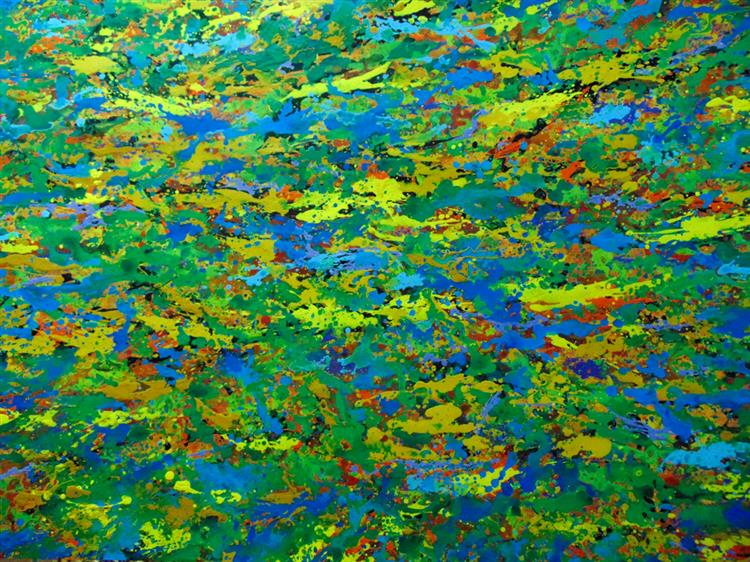 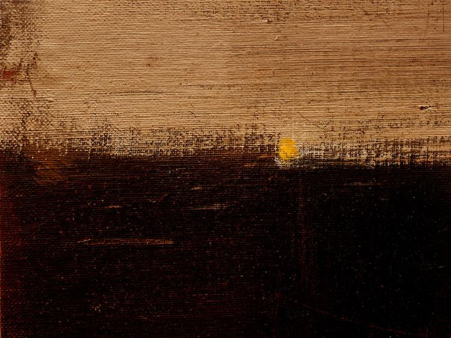 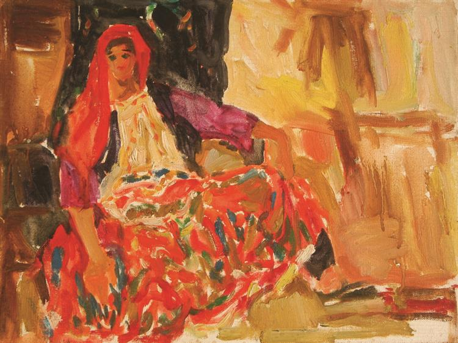 |
| 巴洛克 | 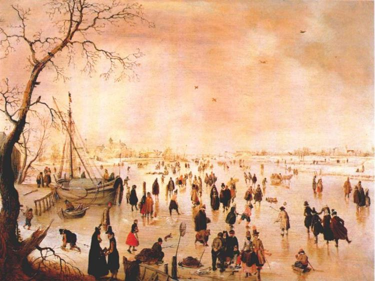 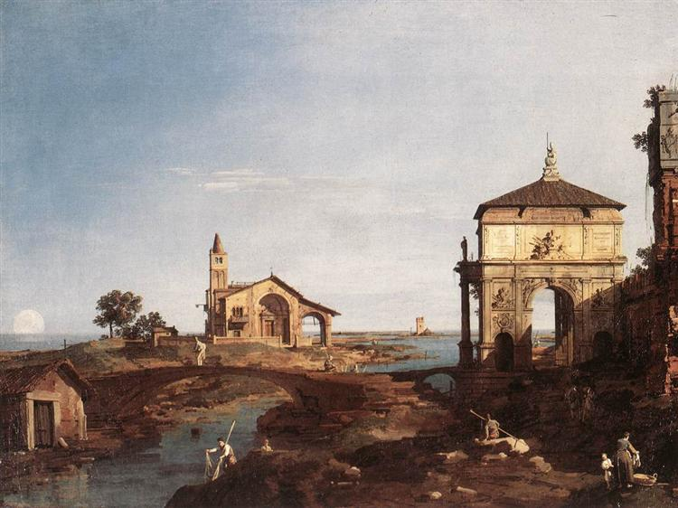 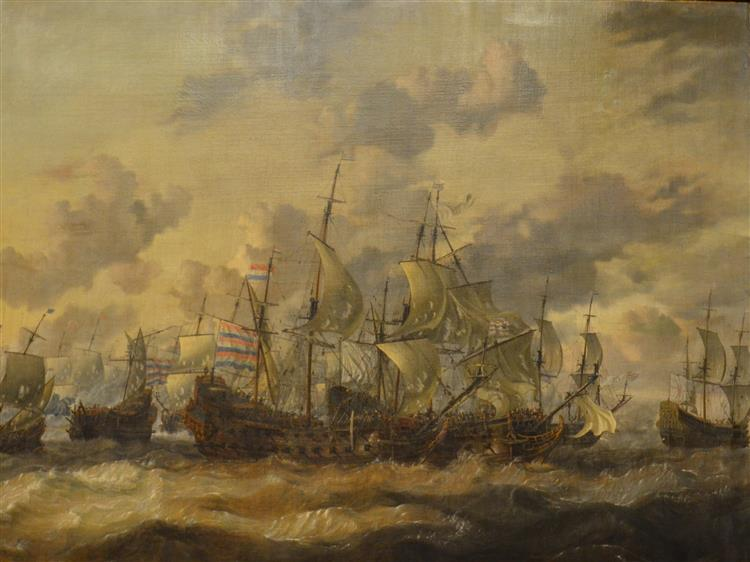 |
| 印象派 | 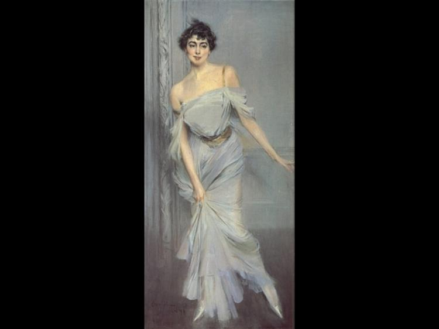 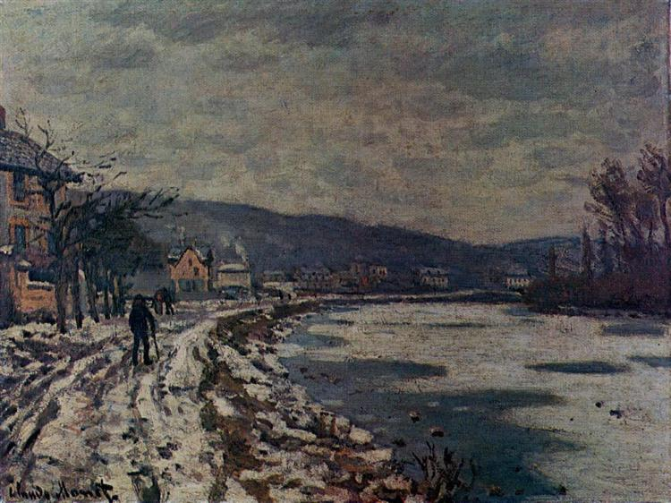 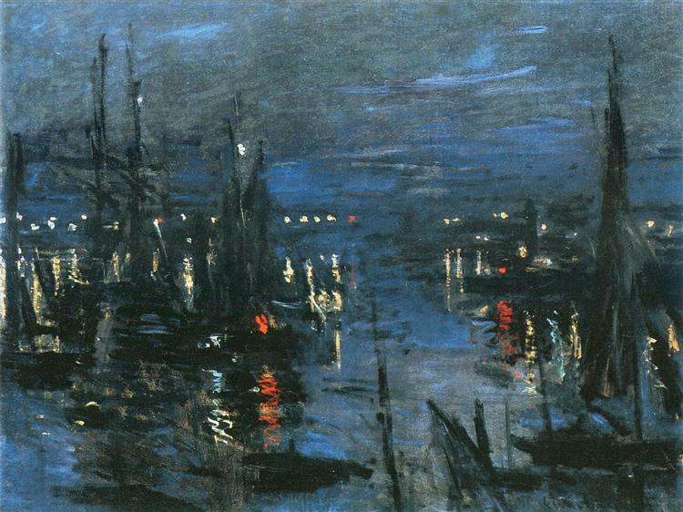 |
| 现实主义 | 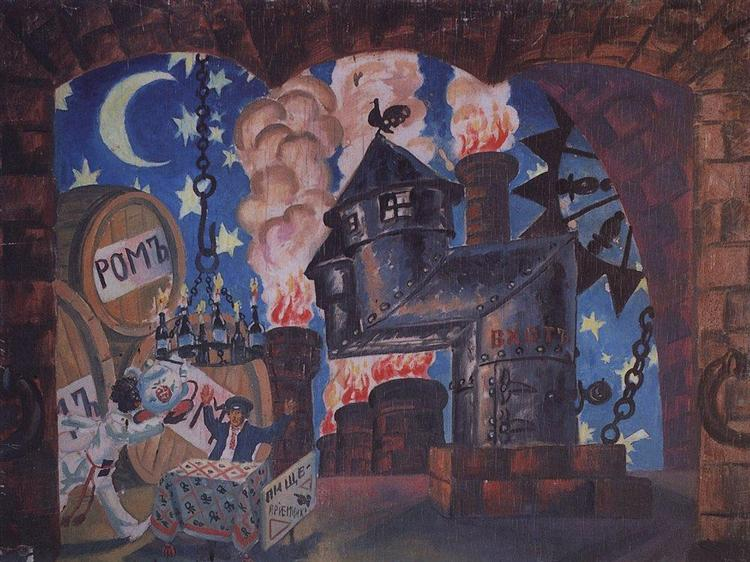 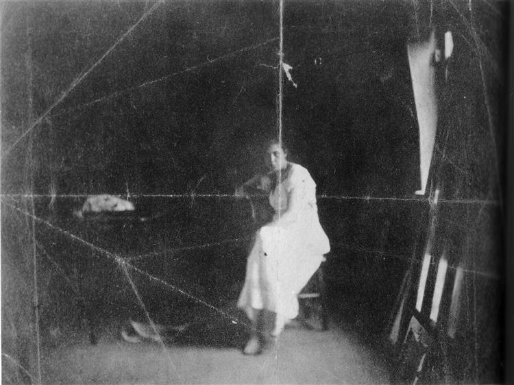 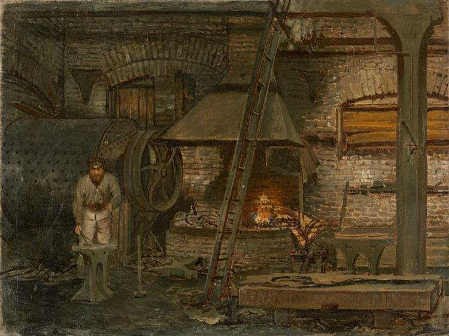 |
| 浪漫主义 | 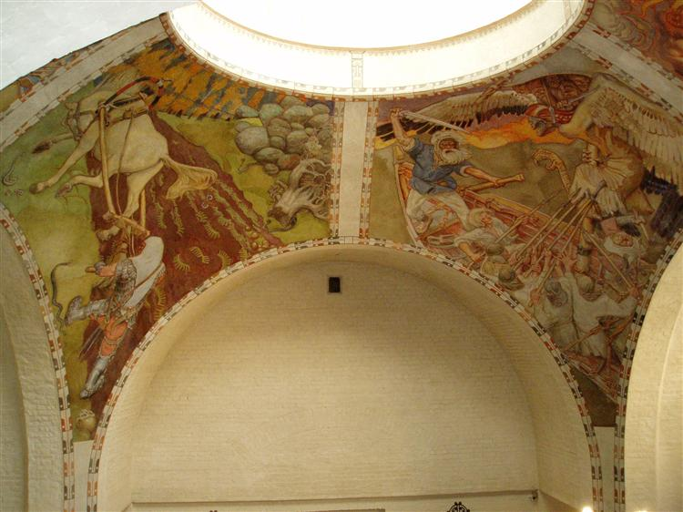 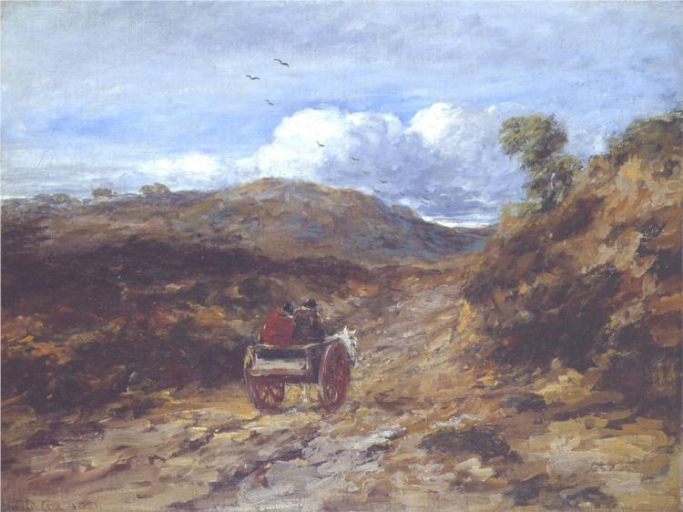 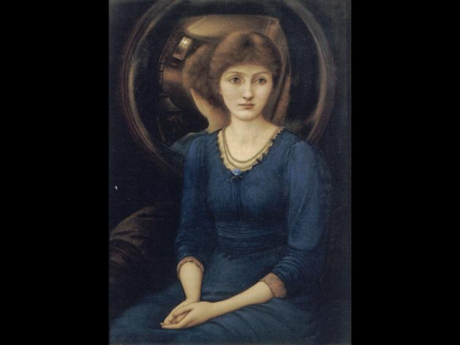 |
| 超现实主义 | 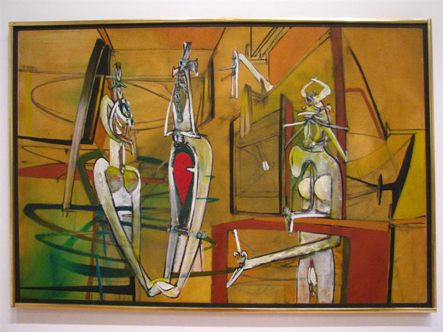 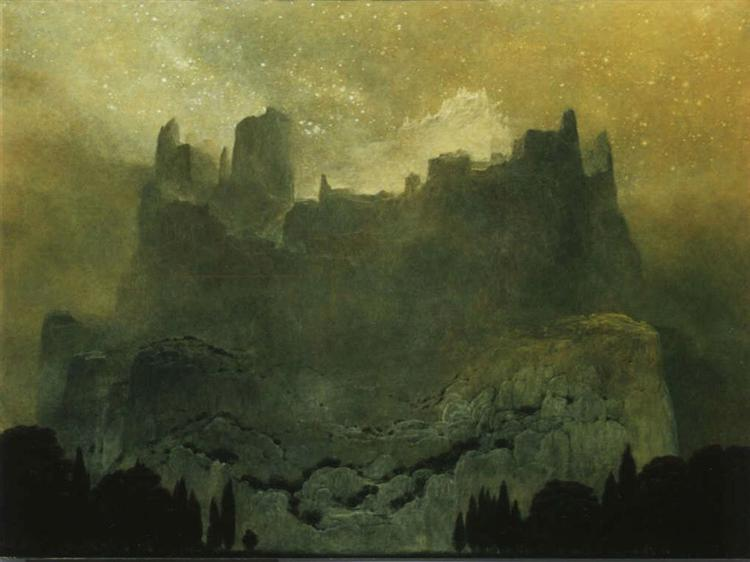 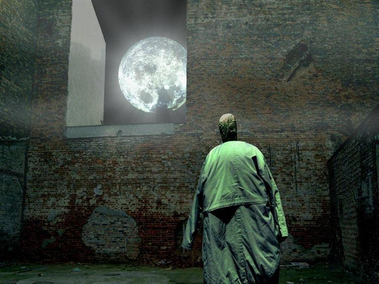 |

## 数据统计信息

### 数据集概览
P2数据集包含总共**25,710张绘画图像**，涵盖6种不同的艺术风格，为绘画风格分类研究提供了全面且平衡的集合。

### 数据量统计
- **总图像数**: 25,710
- **艺术风格**: 6个类别
- **图像格式**: JPG
- **平均分辨率**: 750×562像素（演示图像）
- **数据集大小**: 约1.8GB

### 风格分布
| 艺术风格 | 图像数量 | 百分比 |
|----------|----------|--------|
| 印象派 | 6,277 | 24.4% |
| 现实主义 | 5,622 | 21.9% |
| 浪漫主义 | 5,276 | 20.5% |
| 超现实主义 | 4,508 | 17.5% |
| 抽象表现主义 | 2,971 | 11.6% |
| 巴洛克 | 1,056 | 4.1% |

### 数据特征
- **平衡表示**: 数据集为每种艺术风格提供了充足的样本，印象派占比最高（24.4%），巴洛克占比最低（4.1%）
- **高质量**: 所有图像都通过自动风格不确定性测量（SUM）和设计专业人员的人工验证进行筛选
- **一致格式**: 所有图像都标准化为JPG格式，具有一致的命名约定
- **净化选择**: 图像经过精心选择，确保风格特征清晰一致

## 使用说明
论文发表后发布。

## 数据质量
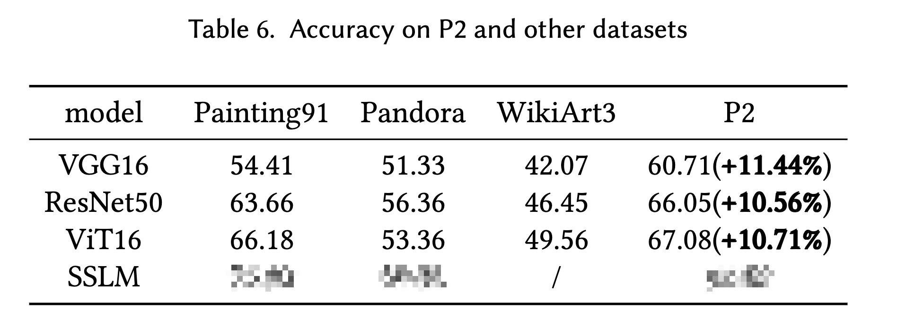

## 引用
等待论文接受。

## 贡献者
我们要感谢以下个人对P2数据集的贡献：

- **黄蕊女士**
- **蒋澈女士**
- **胡成冉女士**
- **崔嘉博士**

## 联系方式
如有问题，请联系：📧 202421055240@mail.scut.edu.cn 或 📧 cuijia1247@scut.edu.cn

## 更新日志

### v2.0.0 (2025-07-20)
- 初始版本发布 
